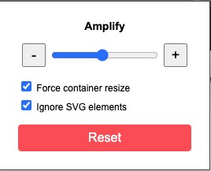
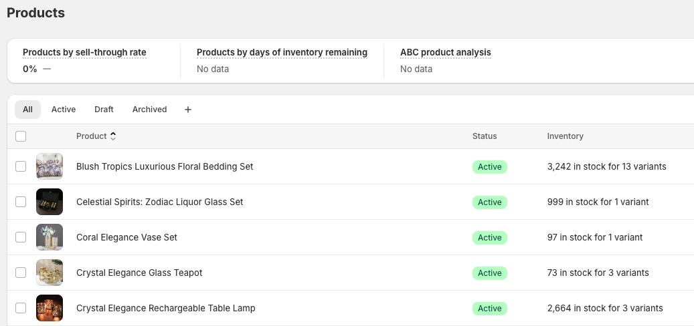
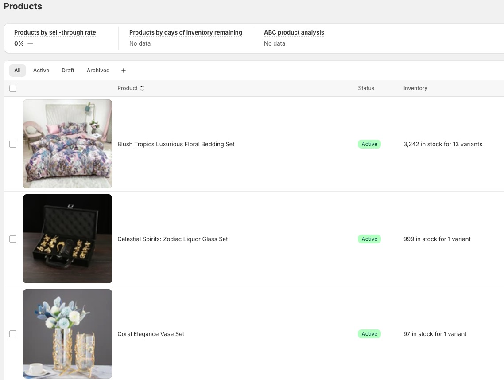

# Icon Amplifier

Icon Amplifier is a Chrome extension designed to enhance your browsing experience by allowing you to resize small images and icons on any website effortlessly. Perfect for Shopify, e-commerce platforms, and websites with small thumbnails or constrained image sizes.

---

## Features

- **Resize Images**: Adjust the size of images and icons on any website with a simple slider.
- **Force Container Resize**: Automatically resize containers to accommodate larger images.
- **Ignore SVG Elements**: Option to exclude SVG elements from resizing.
- **Reset Functionality**: Reset images to their original size with one click.
- **Website-Specific Settings**: Save custom image sizes for specific websites using local storage.
- **Easy to Use**: Intuitive interface with real-time resizing feedback.

---

## Installation

1. Download the extension files from this repository.
2. Open Chrome and go to `chrome://extensions/`.
3. Enable **Developer Mode** (toggle in the top-right corner).
4. Click **Load unpacked** and select the folder containing the extension files.
5. The Icon Amplifier extension icon will appear in your Chrome toolbar.

---

## How to Use

1. Click the **Icon Amplifier** extension icon in the Chrome toolbar.
2. Use the **slider** to increase or decrease the size of images in real time.
3. Check or uncheck the following options:
   - **Force container resize**: Automatically adjust the size of image containers.
   - **Ignore SVG elements**: Skip resizing SVG images.
4. Click **Reset** to restore images to their original sizes (specific to the current website).
5. Save custom sizes for specific websites, and your preferences will persist across sessions.

---

## Permissions

Icon Amplifier requires the following permissions:

- **`activeTab`**: To interact with the currently active tab and resize images dynamically.
- **`scripting`**: To inject JavaScript for resizing images and updating their styles.
- **`storage`**: To save user preferences (e.g., image sizes) for specific websites.
- **`Host Permissions`**: To allow resizing of images on all websites.

---

## Privacy Policy

Icon Amplifier does not collect, store, or share any user data. All user preferences are stored locally in the browser's local storage, and no data is transmitted to external servers.

For more details, please read our [Privacy Policy](./PRIVACY.md).

---

## Contribution

We welcome contributions to improve Icon Amplifier. To contribute:

1. Fork the repository.
2. Create a new branch: `git checkout -b feature/your-feature`.
3. Commit your changes: `git commit -m 'Add some feature'`.
4. Push to the branch: `git push origin feature/your-feature`.
5. Open a pull request.

---

## Screenshots
*Pop-up:*

*Image resizing on Shopify product thumbnails - Before:*

*After:*

---

## License

This project is licensed under the [GNU Affero General Public License v3.0](https://www.gnu.org/licenses/agpl-3.0.html).

AGPL is like saying "Here's my recipe, you can use and modify it, BUT:

- If you serve food using this recipe in a restaurant, you must share your modified recipe with your customers.

- If you change the recipe, those changes must also be shared.

- Anyone who gets your version must get the same freedoms.

---

## Disclaimer

This extension is provided "as is" without any warranties. Use it at your own risk.

---

Enjoy enhancing your browsing experience with **Icon Amplifier**!
